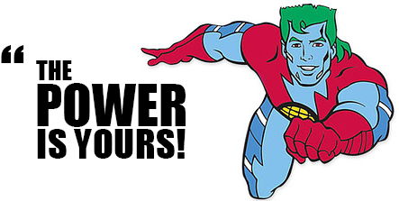

# An Objectively Challenging Game

### Introduction

You'll be making a game, setting up the objects and manipulating the html we've provided.

This project will be _very much_ a set of tasks for you to do, described in no great detail. You'll have to figure out how to implement the specifications, but we'll lay them out.

### Reference Site

If you want to see the code at work, check out [the full game](http://objectively-challenging.surge.sh/). It works, though it could sure use some love at some point.

### Setup

* Create objects called `monster` and `boss` in `enemies.js` and `player` in `player.js`. Give them all a `hitPoints` property, an `attackMin` property, and an `attackMax` property; the first will be how much "health" they currently have, and the last two will be used to randomly generate attack damage.
* Create a variable to store which monster we're currently attacking, and set it to be the `monster`. We'll change it to be the `boss` if the user gets that far, so create it using `let`!
* Set up an event listener for the Fight button. It should run a function (named whatever you want) that will run every time they click "Fight".

### Our Attack Round

Every time they click the "Fight" button, we need to:

* Get the player's damage done using the `getAttackDamage`, a simple, mathy function we pre-wrote for you. Note that it takes in two parameters; these will be a minimum and maximum damage.
* Decrement the current monster's hit points by that number.
* If the current monster's hit points are at or below 0, check which monster we're on. If it was the regular monster, update our current monster to be the boss. If it was the boss, the player has won. We'll update the DOM to reflect that, but we'll talk DOM in a bit.
* Now, if the monster is NOT dead, they can attack the player. Get the monster's damage using the `getAttackDamage` function, and decrement hte player's hit points by that number.
* No matter what happens, we'll need to do some DOM manipulation to update the health bars. We highly suggest using a helper function that you call at the end of your attack round function. But if not, the code can just live at the end of your function. Now, what should that code be?
* Check out the `html`. There are two health bars there that are divs with background colors and set widths. By manipulating the widths, we can change how long the bars should be. There is also some text inside the div, representing the number. So what we need to do is change the text in there to be the player or monster's hit points, and the width to be some width in terms of that hit points. That way, the number will change and the bar will change size based on the hit point calculations we just did!
* For a stretch goal, you can also rotate our Mario image according to his hit points, using CSSs `transform: rotate` function. Feel free to research! The ideal would be to have him at fully upright when he's at 100 hit points and lying straight down when he's at 0. You'll  need to translate from a number out of 100 to a degree out of 360. This is totally doable!

### The Player Is Dead

* Now, back above, if the player died, we'll need to set things up so they can play again. Run the code only if the player's hit points are at or below 100, though you can put the code there or go to a helper function.
* The helper function should change our "Fight" button to say "Start Over". It should also remove the event listener from before so that we can add a new one. Look up `removeEventListener`; it works much like its adding counterpart. Remove your attack round manager, and add a new event listener to start things over.
* In addition to changing the event listener, we also need to adjust the hit points back to their starting numbers (check `enemies.js` and `players.js` if you don't know what those were!). Then run our update health bars function or code again to reflect those new numbers.
* The final thing the player-died section needs is to reset our current monster back to `monster`, since it might be `boss` right now.

### Starting Over

Since we did so much of the work BEFORE the user hit "Start Over", all we need to do in the new event listener function is give them the option to fight again.

* Remove the old event listener from our button and put our attack round manager back in there.
* Change the button's text back to "Fight".

### Giving The User A Sense Of What's Going On

We have a working game now! But the user doesn't really know what's happening yet. So let's change the text in the "results", "player damage taken" and "monster damage taken" sections of our app (check the html!) as events occur.

* Whenever the monster hits the player or vice versa, take that "damage taken" and put it in a sentence in their respective "damage taken" sections of the DOM. Something like, "The monster hits you for x damage." with "x" standing in for the actual number.
* As a stretch goal, check how much the damage was and add some flavor text. If it was more than 5, for example, you could say, "The monster clobbers you for x damage!". You could have several different verbs depending on the number, or change how many exclamation points you get. If you have a number of `if/else`s here, you might want to break these bits of code off into their own functions.
* Finally, let's have some bigger picture events. That's what the "results" section is for! Change the text in there according to what's happening. Did the player die? Tell them the game's over. Did the monster die and now the boss is coming? Tell them that! Did they beat the boss and win! Let them know they should high five their screen. Figure out where in the logic these messages should be sent out, and tell them whatever you want!

### Customizing Your Game

* The Mario theme is stupid. Change the images, the title of the page, or anything else to make the game yours. Add some enemies pictures! Go _ham_.
* Try to make the game even by tweaking the values in your objects. Games are more fun if you aren't sure if you're gonna win or not!
* Finally, add whatever you want. Items the player picks up. Armor to mitigate damage. Different kinds of enemies with different abilities.

